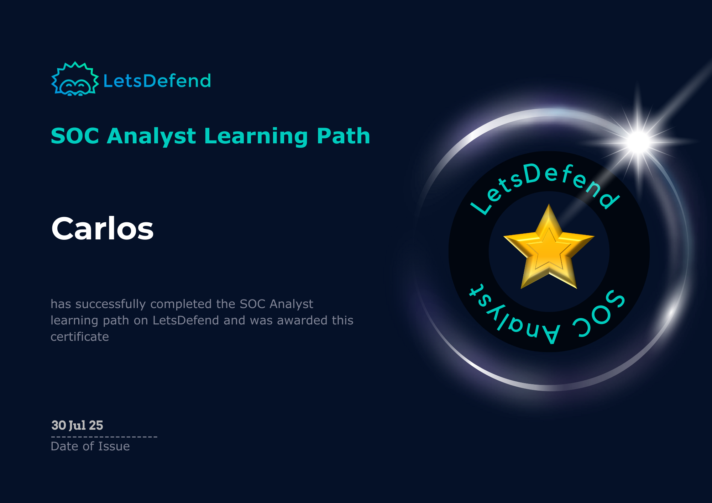

# 🎯 LetsDefend SOC Analyst Learning Path

📜 **Certificate Completed**  

🧠 Hands-on Cybersecurity Training | 👨‍💻 Real-World SOC Scenarios

---

## 🔗 About the Learning Path

I completed the [**LetsDefend SOC Analyst Learning Path**](https://app.letsdefend.io/path/soc-analyst-learning-path), a practical, browser-based training platform designed to simulate real-world SOC operations. The path focuses on threat detection, incident response, and analysis using tools commonly used in the industry.

---

## 🧠 My Experience

I recently completed the LetsDefend SOC Analyst Learning Path, which gave me hands-on experience with real SOC tools like **SIEMs** and **EDRs**. Throughout the path, I learned how to detect and respond to different types of attacks, including phishing, brute force, and malware.

The training helped me understand how a Security Operations Center operates, and how to investigate alerts, analyze logs, and apply frameworks like **MITRE ATT&CK**. Each task gave me practical skills that I can use in real-world SOC environments, and it really boosted my confidence.

Big thanks to LetsDefend for the quality material — I really enjoyed the experience and had a lot of fun along the way!

---

## 🏅 Certificate

